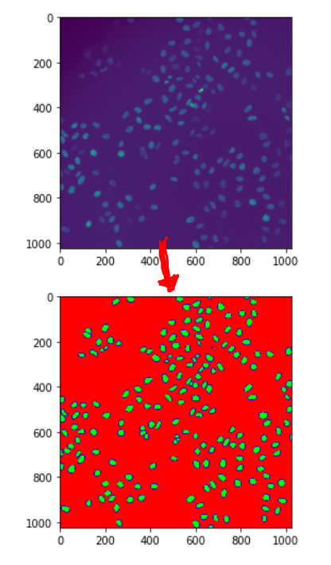

# `unet_nuclei`: segment fluorescently labelled nuclei with a pre-trained u-net



## Overview

This package provides stand-alone version of unet segmentation of fluorescent nuclei based on the code from the Cellprofiler plugin 
https://github.com/CellProfiler/CellProfiler-plugins/blob/master/classifypixelsunet.py . This is mainly code from the Cellprofiler team (see the Acknowledgements section below).

The package comes bundled with a pre-trained Unet to segment fluorescece microsopy images of cell nuclei. The output of the network is a three-channel classification result that provides the probabilities for a pixel to be part of a background, nucleus and boundary pixel. The seperate boundary class is useful for splitting clumped nuclei.

This package was mainly created for personal use, so I can integrate the nuclei segmentation in my own python code without CellProfiler as a dependency. I'm putting it on Github in case others find it useful.

## Requirements and installation

To install use pip (you may have to use `pip3` if your default `pip` refers to python 2.7):

```
pip install git+https://github.com/VolkerH/unet-nuclei.git
```

Or clone the repo and install using `setup.py`:

```
git clone https://github.com/VolkerH/unet-nuclei.git
python setup.py install
```

Note that the `requirements.txt` file does not specify any backends for Keras (see comments in the next section) as there are several options. Therefore you have to install one of the following backend packages using `pip` or `conda` and select it as as explained in the following section.

* [plaidml-keras]((https://github.com/plaidml/plaidml/blob/master/docs/install.rst).) (recommended if you have a GPU that is not supported by CUDA, i.e. many laptop GPUs and AMD graphic cards. Also works with CUDA). Don't forget to run `plaidml-setup` once after installing `plaidml-keras`.
* tensorflow-gpu (recommended if you have CUDA.)
* [cntk](https://docs.microsoft.com/en-us/cognitive-toolkit/setup-windows-python?tabs=cntkpy26#2-install-from-wheel-files) (not sure why one would use this. requires CUDA and Windows)
* tensorflow (CPU-based tensorflow. Too slow to be of practical use for segmenting reasonably sized images)

## GPU (OpenCL/Cuda) or CPU support - choose the right Keras backend

The unet is implemented using Keras, a high-level python package for describing neural network architectures.
Keras can use different backends for implementing these networks. While tensorflow is the most widespread
backend, there are other options. In particular worth mentioning is the option to use [`PlaidML`](https://github.com/plaidml/plaidml). **Using PlaidML you can leverage GPU acceleration for many GPUs that do not have CUDA drivers, including many of the GPUs found in laptops.** For instructions on how to set up PlaidML as a Keras backend see [these installation notes](https://github.com/plaidml/plaidml/blob/master/docs/install.rst).

Select the backend by setting the environment variable `KERAS_BACKEND` to either

* `plaidml.keras.backend` for PlaidML
* `tensorflow` if you have installed `tensorflow-gpu` or `tensorflow`
* `cntk`

You can set the variable either from the calling shell or in your python code using
```
import os
os.environ["KERAS_BACKEND"] = "plaidml.keras.backend" # or "tensorflow" or "cntk"
```

Other options to set the backend are described here: https://keras.io/backend/.

## Usage

See the example Jupyter notebook under [`./notebook/test_unet_nuclei.ipynb`](./notebook/test_unet_nuclei.ipynb).

## Acknowledgements, license and code provenance

The code is under a BSD-3 License, for the core part see [https://github.com/CellProfiler/CellProfiler-plugins/issues/72](https://github.com/CellProfiler/CellProfiler-plugins/issues/72).

As mentioned in the Overview section, the core functionality of this package is based on code 
by the Cellprofiler team, specifically based on [this publication by Juan Caicendo, Tim Becker, Claire McQuinn et al](https://www.biorxiv.org/content/10.1101/335216v1). They also provided the pre-trained weights for the model.
I derived the code from the [Cellprofiler Unet plugin](https://github.com/CellProfiler/CellProfiler-plugins/blob/master/classifypixelsunet.py) but the original code for the publication is [here](https://github.com/carpenterlab/unet4nuclei).

The code snippets for determining valid shapes to feed into the unet are taken from Eric Czech's reply to  [this Gitub issue](https://github.com/CellProfiler/CellProfiler-plugins/issues/65).

The sample images in the examples directory are taken from the test set of the EMBO High-Troughput screening course 2012 (Beate Neumann and Jutta Bulkescher).

## Contributing

Github issues and pull requests are welcome.

March 2019, Volker Hilsenstein
